# DKU Dining Wrap

## Online demo

- Live preview: https://williamguo34.github.io/dku-dining-wrap/

<p align="left">
  
</p>

A local-only “year-in-review” tool that turns your DKU campus card transactions into Spotify-Wrapped–style cards.

> Disclaimer: This project is not affiliated with Duke Kunshan University. All data is processed locally in your browser and never sent to any server.

## What it does

- Uses a bookmarklet script to scrape “Transaction History” records from the DKU card website.
- Automatically cleans and classifies transactions, filtering out top‑ups, printing, insurance, etc.
- Computes stats such as total meals, total spend, average meal cost, favorite stalls, active hours, active days/months, and more.
- Generates a multi-card “Wrapped” experience: personality, big picture, timeline, daily rhythm, location rankings, achievements, memories, predictions, shareable quotes, etc.
- Lets you export the current card or all cards as PNG images for easy sharing.

## How to use (quick guide)

### For Edge / Chrome users

1. Show the bookmarks bar  
   - Edge: turn on “Show favorites bar”.  
   - Chrome: enable “Show bookmarks bar”.  
   
   | Edge | Chrome |
   |------|--------|
   | 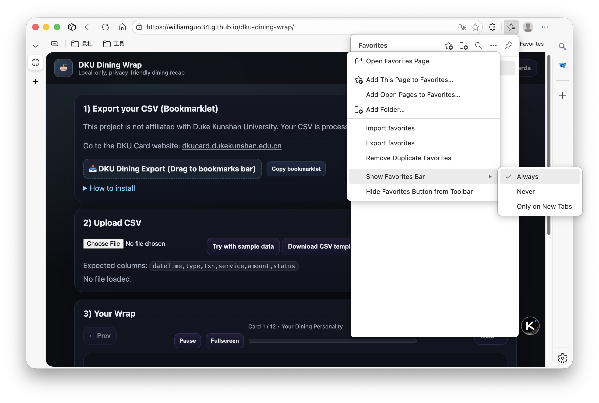 | 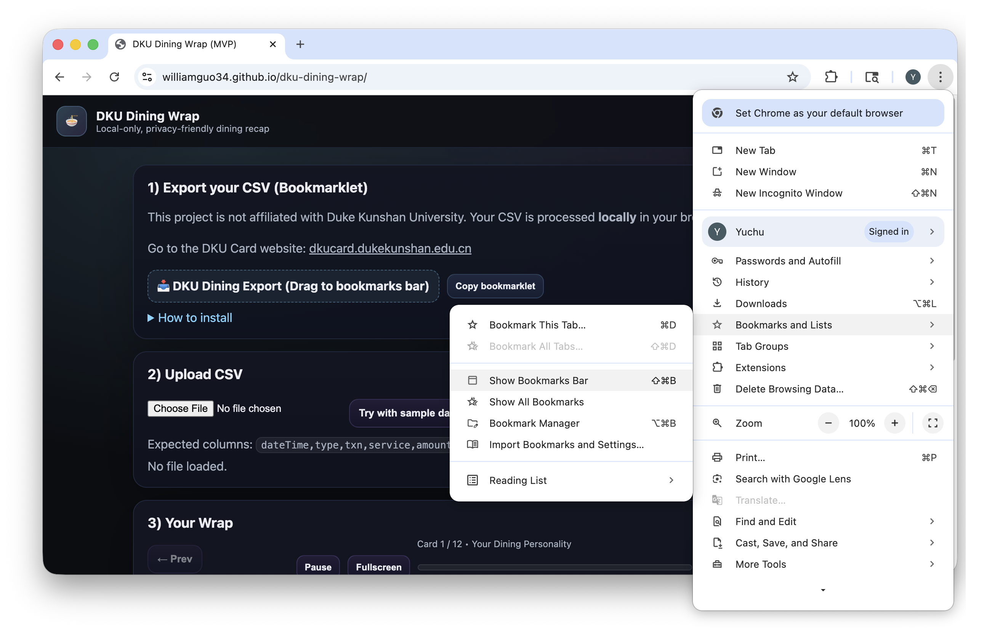 |
2. Add the exporter bookmark  
   - On the DKU Dining Wrap page, drag the “📥 DKU Dining Export” button to the bookmarks bar.  

   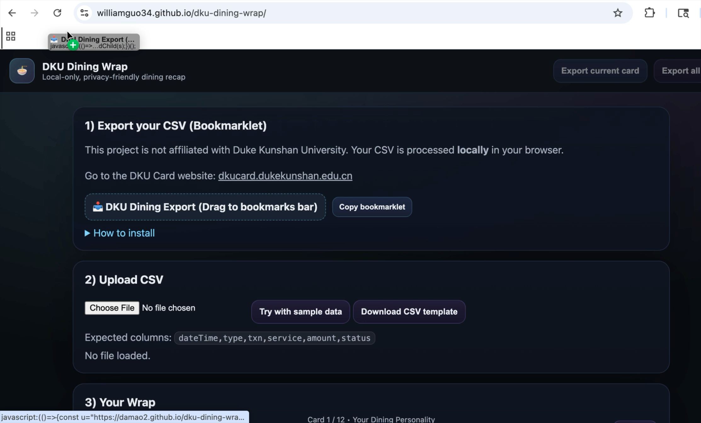  
   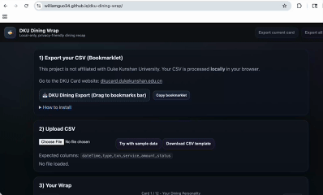
3. Run it on the DKU Card Transaction History page  
   - Open the DKU card site → “Transaction History” page.  
   - Click the bookmark you just added.  

   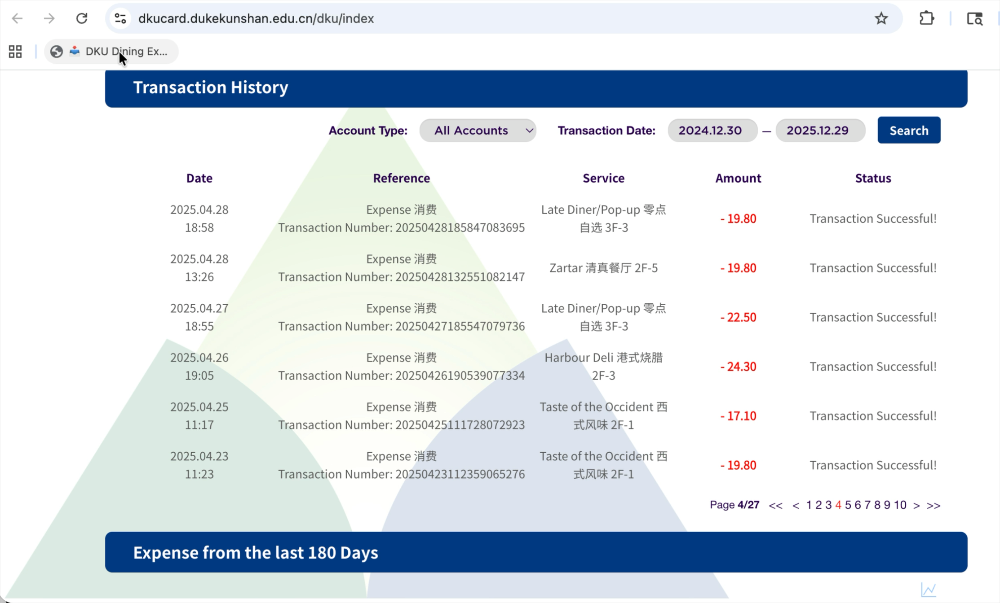  
   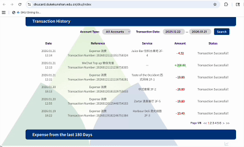
   - The script will scrape your history and **automatically open** DKU Dining Wrap with your data (no CSV needed in most cases).

### For Safari users

Safari has stricter rules for `window.name` and clipboard, so you may need one extra CSV step.

1. Show the bookmarks bar and add the exporter bookmark  
   - Show the bookmarks bar, then drag the “📥 DKU Dining Export” button to it.  

   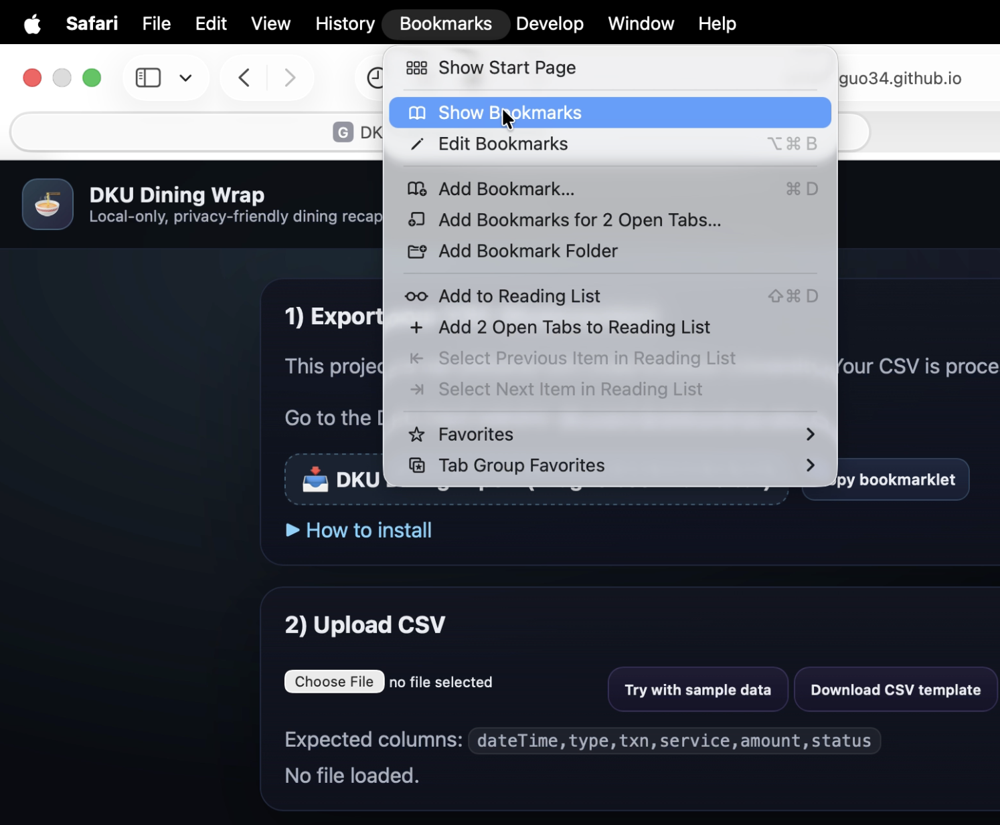  
   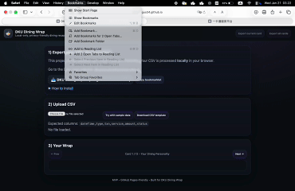
   
2. Run it on the DKU Card Transaction History page  
   - Open the DKU card site → “Transaction History” page.  
   - Click the bookmark.  
   
   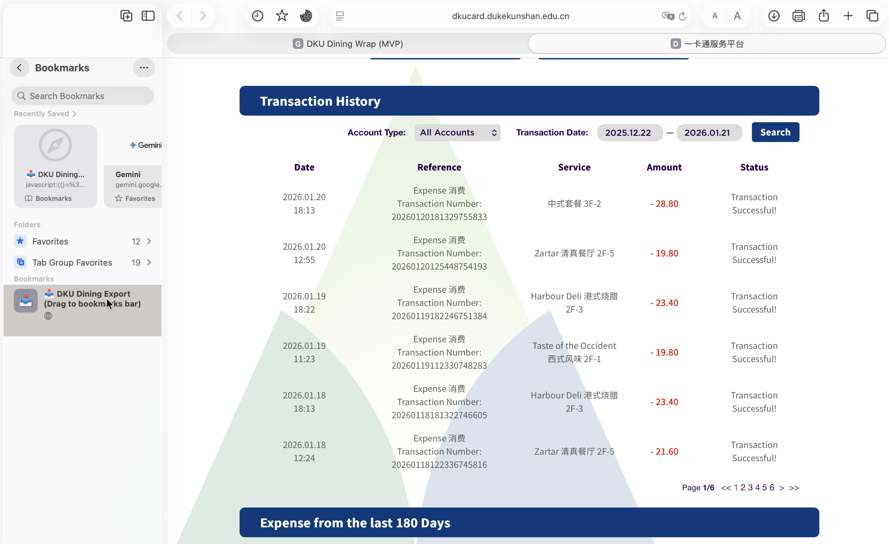
   - If everything works, Safari will open DKU Dining Wrap with your data automatically.  
3. If Safari cannot hand off the data  
   - The script will fall back to downloading a CSV.  
   
   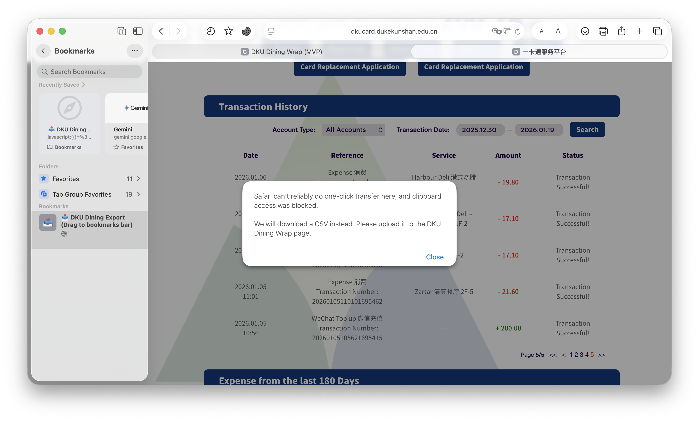
   
   - Then open DKU Dining Wrap, go to section “2) Upload CSV”, and upload the downloaded file.  
   
   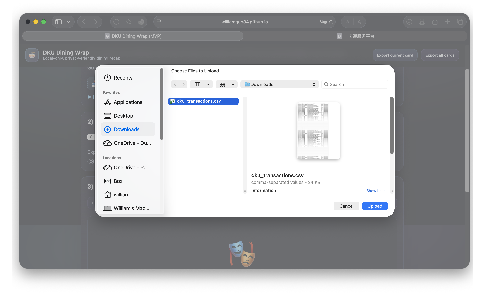

## Quick start

1. Open `index.html`  
   - You can open it directly from the filesystem, or host it on GitHub Pages / any static hosting.
2. Install the export bookmarklet  
   - On the page, find the “📥 DKU Dining Export” button.  
   - Drag it to your browser’s bookmarks bar, or copy its URL into a new bookmark.
3. Export transactions from the DKU card site  
   - Go to `https://dkucard.dukekunshan.edu.cn/dku/index` and open the “Transaction History” page.  
   - Click the bookmarklet; the script will iterate over time windows and fetch all pages of results.  
   - Default mode: it does **not** download a CSV. Instead it packs the rows into `window.name`, hands them off to the Wrap page, and redirects automatically.  
   - If you prefer a CSV download, set in the browser console:
     ```js
     window.__DKU_DINING_EXPORT_MODE__ = "download";
     ```  
     then click the bookmarklet again.
4. View your Wrap  
   - One‑click handoff mode: the Wrap page will auto‑load the data and start the card slideshow.  
   - CSV mode: click “2) Upload CSV” and upload the exported `dku_transactions.csv`.

## Data format

Both the bookmarklet and manual CSV uploads use the same schema:

```text
dateTime,type,txn,service,amount,status
```

- `dateTime`: timestamp like `2024-09-01 12:30:00`.
- `type`: transaction type text (e.g. `Expense`, `WeChat Top Up`, `Social Medical Insurance`).
- `txn`: transaction ID (optional, used for de‑duplication).
- `service`: location / stall name (e.g. `2F-5 Malatang`).
- `amount`: amount string, with expenses as negative numbers (e.g. `-25.00`).
- `status`: status text (e.g. `Success`).

`app.core.js` will:

- Convert negative expenses into positive spend values.
- Classify rows into `dining` / `topup` / `printing` / `admin` / `other`.
- Filter down to true dining-related expenses.

## File overview

- `index.html`: SPA entry point with the upload area, wrap shell, and navigation controls.
- `style.css`: visual design and animations, roughly matching a “Wrapped” look.
- `app.core.js`: pure data logic (parsing amounts/dates, dining detection, aggregations, achievements, personality, etc.).
- `app.ui.js`: UI + interaction layer; responsible for:
  - Parsing CSV (via PapaParse);
  - Rendering cards and charts (Chart.js);
  - Autoplay, progress bar, fullscreen, hover/tilt effects;
  - Exporting cards as PNG (html2canvas).
- `export-dku-transactions.js`: bookmarklet-loaded exporter that runs on the DKU card site; it:
  - Iterates over a time range in windows and submits queries for “Transaction History”;
  - Scrapes all pages, then de‑duplicates rows;
  - Outputs either a standard CSV or a `window.name` payload consumed by the Wrap page;
  - Includes Safari-specific handling (new-tab handoff / clipboard fallback, etc.).

## Privacy & security

- Scraping, cleaning, and aggregation all happen entirely in your browser; there is no backend.
- When using the `window.name` handoff, your data only lives in the current browser session for a short time.
- You can delete any downloaded CSV files at any time.

## Development & debugging

This is a static, build-free frontend project:

- Just open `index.html` in a browser to use it.  
- To debug the bookmarklet against the real DKU site, you can:
  - Paste the contents of `export-dku-transactions.js` into the DevTools console on the Transaction History page, or
  - Point `BOOKMARKLET_SRC` / `WRAP_URL` to your local/test environment while developing.
